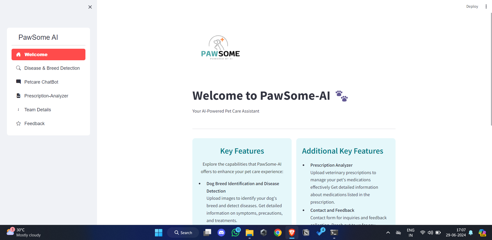
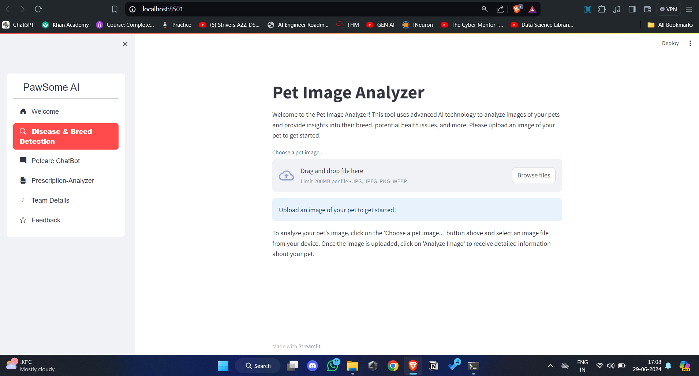
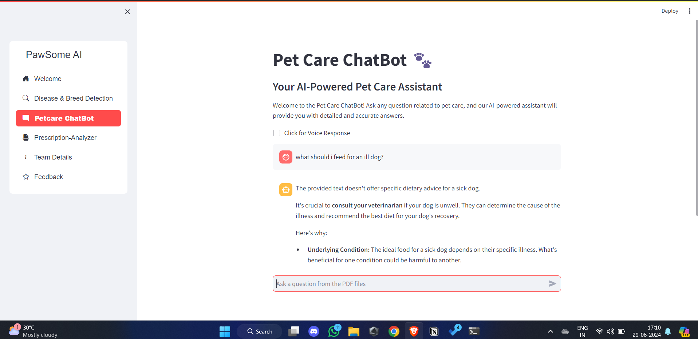
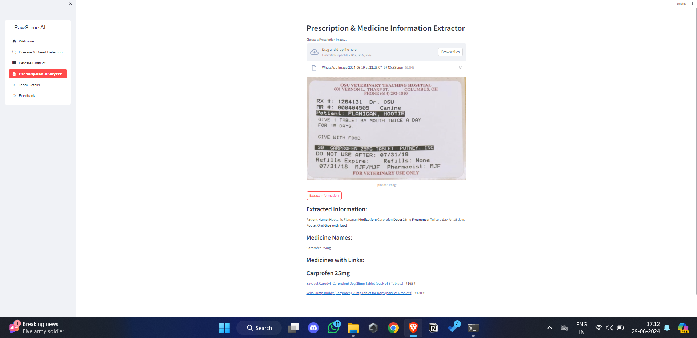

# PawSome AI 🐾

Welcome to PawSome AI, an innovative application designed to assist pet owners with various tasks such as disease and breed detection, pet care chatbot, and prescription analysis.

## Table of Contents
1. [Features](#features)
2. [Screenshots](#screenshots)
3. [Installation](#installation)
4. [Usage](#usage)
6. [License](#license)

## Features
- **Disease & Breed Detection**: Identify pet diseases and breeds using Gemini Vision Model.
- **Petcare ChatBot**: Interact with our AI-powered chatbot for pet care advice with speech response.
- **Prescription Analyzer**: Analyze pet prescriptions for better understanding and management and find links to buy online.

## Screenshots
### Home Page


### Disease & Breed Detection


### Petcare ChatBot


### Prescription Analyzer


## Installation
To run this project locally, follow these steps:

1. **Clone the repository**
   ```sh
   git clone https://github.com/your-username/pawsome-ai.git
   cd pawsome-ai

2. **Install the required dependencies**

   ```
   python -r install requirments.txt

## Usage


1. **Run the Streamlit application**
   ```
   python -m streamlit run app.py

## License

[MIT](https://github.com/MohammedMusharraf11/PawSome-AI/blob/main/LICENSE)
